# 1、什么是JUC

面试高频

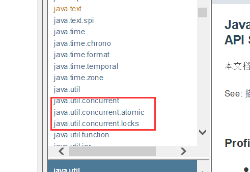

java.util工具包

**业务：普通的线程代码 Thread**

**Runnable** 没有返回值，效率相比**Callable**相比较低

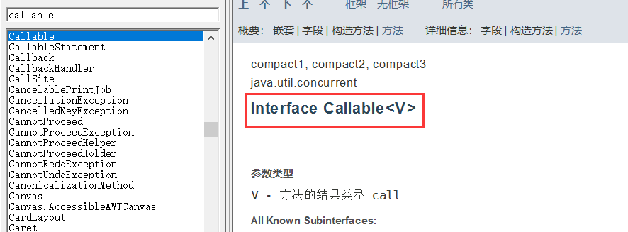

# 2、线程和进程

>   线程、进程

进程：一个程序，QQ.exe，Music.exe的集合

​	一个进程至少有一个线程

​	java默认的线程：main(主线程)、GC(垃圾回收)

线程：IDEA在输入代码的同时会自动保存，输入代码——自动保存，两个不同的线程

Thread、Runnable、Callable

==java真的可以开启线程吗？==开不了

```java
public synchronized void start() {
    /**
         * This method is not invoked for the main method thread or "system"
         * group threads created/set up by the VM. Any new functionality added
         * to this method in the future may have to also be added to the VM.
         *
         * A zero status value corresponds to state "NEW".
         */
    if (threadStatus != 0)
        throw new IllegalThreadStateException();

    /* Notify the group that this thread is about to be started
         * so that it can be added to the group's list of threads
         * and the group's unstarted count can be decremented. */
    group.add(this);

    boolean started = false;
    try {
        start0();
        started = true;
    } finally {
        try {
            if (!started) {
                group.threadStartFailed(this);
            }
        } catch (Throwable ignore) {
            /* do nothing. If start0 threw a Throwable then
                  it will be passed up the call stack */
        }
    }
}

/*
	本地方法
	native是与C++联合开发的时候用的！使用native关键字说明这个方法是原生函数，也就是这个方法是用C/C++语言实现的，并且被编译成了DLL，由java去调用
	*/
private native void start0();
```

>   并发、并行

并发编程：并发、并行

并发(多线程操作同一个资源)

-   CPU一核，模拟出来多个线程，快速交替

并行(多个人一起行走)

-   CPU多核，多个线程可以同时执行

```java
/*
获取CPU的核数
CPU密集型，IO密集型
* */
Runtime.getRuntime().availableProcessors()
```

并发编程的本质：**充分利用CPU资源**

>线程有几个状态

```java
public enum State {
    	//新生
        NEW,
		//允许
        RUNNABLE,
		//阻塞
        BLOCKED,
		//等待，一直等待
        WAITING,
		//超时等待
        TIMED_WAITING,
		//终止
        TERMINATED;
}
```

>   wait、sleep区别

1.  来自不同的类
    -   wait => Object
    -   sleep => Thread
2.  关于锁的释放
    -   wait会释放锁
    -   sleep不会释放锁
3.  使用范围不同
    -   wait必须在同步代码块
    -   sleep可以再任何地方使用
4.  是否需要捕获异常
    -   wait不需要捕获异常——需要捕获的是中断异常(InterruptedException)==线程都需要捕获这个异常==
    -   sleep必须捕获异常

# 3、Lock锁

>   传统synchronzied同步

```java
public synchronized void sale() {
    if (number > 0) {
        System.out.println(Thread.currentThread().getName() + "卖出了" + (number--) + "票，剩下" + number + "票");
}
```

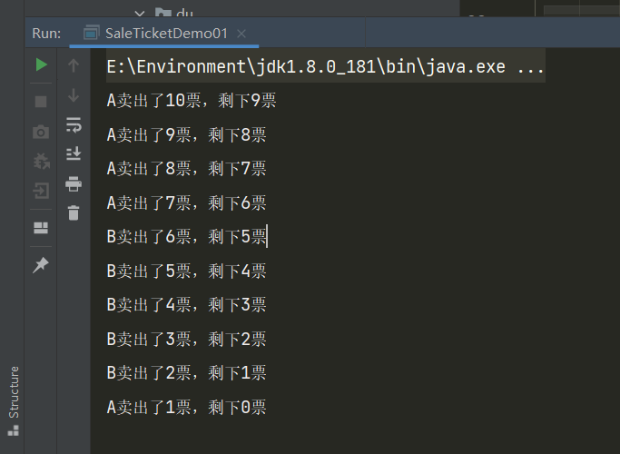

>   Lock接口

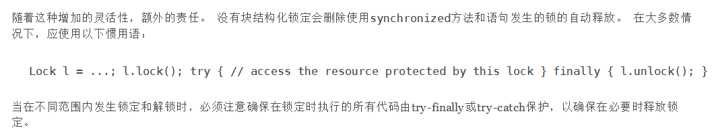

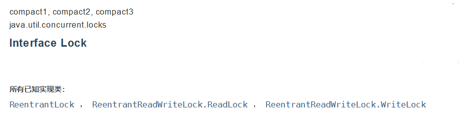

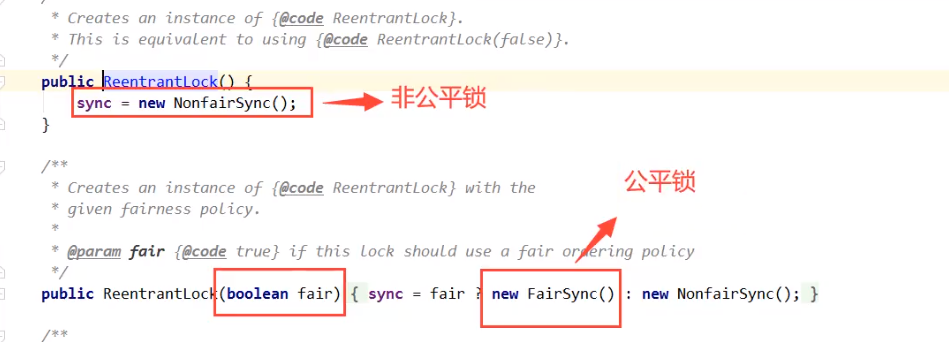

公平锁：十分公平，先来后到

非公平锁：十分不公平，可以插队(默认)

```java
Lock lock = new ReentrantLock();

public synchronized void sale() {
        //加锁
        lock.lock();
        try {
            if (number > 0) {
                System.out.println(Thread.currentThread().getName() + "卖出了" + (number--) + "票，剩下" + number + "票");
            }
        } catch (Exception e) {
            e.printStackTrace();
        } finally {
            //解锁
            lock.unlock();
        }
    }
```

>   Synchronized和 Lock 区别

1.  Synchronized	内置关键字；Lock是一个java类
2.  Synchronized    无法判断获取锁的状态；Lock可以判断是否获取到了锁
3.  Synchronized    会自动释放锁；Lock必须要手动释放锁，否则会造成**死锁**问题
4.  Synchronized    线程1(获得锁，阻塞)、线程2(等待，一直等待)；Lock不一定会一直等待下去。lock.trylock 尝试获取锁
5.  Synchronized    可重入锁，不可中断的，非公平；Lock，可重入锁，可以中断，可以手动设置是否公平
6.  Synchronized    适合锁少量的代码同步问题；Lock 锁大量的同步代码！

# 4、生产者和消费者

>   synchronized版 wait notify

```java
package com.du.ProducerConsumer;

public class Test1 {
    public static void main(String[] args) {
        Data data = new Data();
        new Thread(() ->{
            for (int i = 0; i < 10; i++) {
                try {
                    data.increment();
                } catch (InterruptedException e) {
                    e.printStackTrace();
                }
            }
        },"A").start();

        new Thread(() ->{
            for (int i = 0; i < 10; i++) {
                try {
                    data.decremnet();
                } catch (InterruptedException e) {
                    e.printStackTrace();
                }
            }
        },"B").start();
    }
}

class Data{
    private int number = 0;

    //+1
    public synchronized void increment() throws InterruptedException {
        
        //if可能会出现虚假唤醒问题，使用while解决
        if (number != 0){
            //等待
            this.wait();
        }
        //代码执行
        number++;
        System.out.println(Thread.currentThread().getName() + "=>" +number);
        //唤醒其他线程
        this.notifyAll();
    }

    //-1
    public synchronized void decremnet() throws InterruptedException {
        if (number == 0){
            this.wait();
        }
        number--;
        System.out.println(Thread.currentThread().getName() + "=>" +number);
        this.notifyAll();
    }
}
```

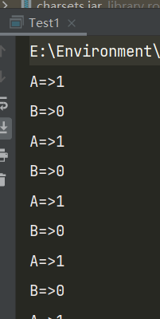

>   增加线程就会出现问题，存在A、B、C、D多个线程，虚假唤醒

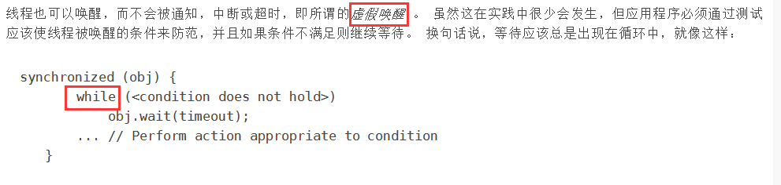

>   JUC版

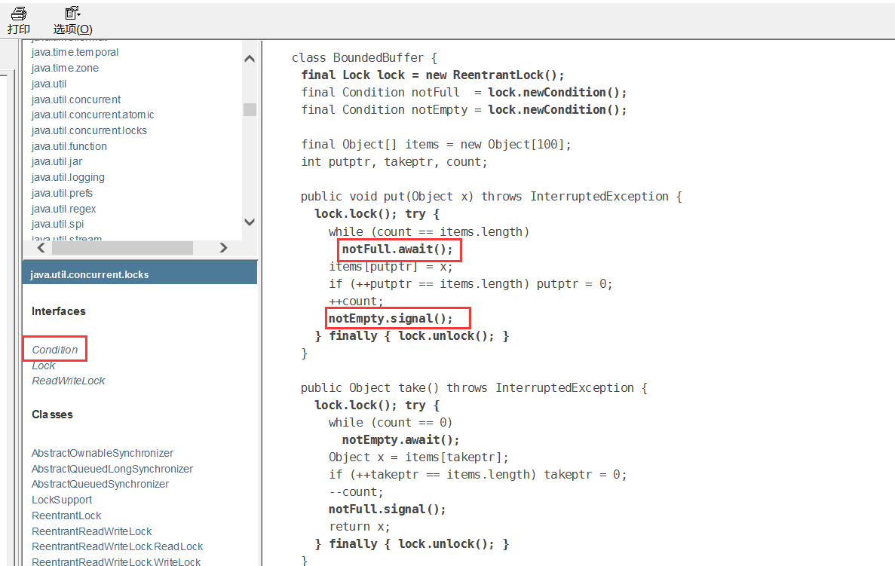

```java
package com.du.ProducerConsumer;

import java.util.concurrent.locks.Condition;
import java.util.concurrent.locks.Lock;
import java.util.concurrent.locks.ReentrantLock;

public class Test2 {
    public static void main(String[] args) {
        Data2 data = new Data2();

        new Thread(() ->{
            for (int i = 0; i < 10; i++) {
                try {
                    data.increment();
                } catch (InterruptedException e) {
                    e.printStackTrace();
                }
            }
        },"A").start();

        new Thread(() ->{
            for (int i = 0; i < 10; i++) {
                try {
                    data.decremnet();
                } catch (InterruptedException e) {
                    e.printStackTrace();
                }
            }
        },"B").start();

        new Thread(() ->{
            for (int i = 0; i < 10; i++) {
                try {
                    data.increment();
                } catch (InterruptedException e) {
                    e.printStackTrace();
                }
            }
        },"C").start();

        new Thread(() ->{
            for (int i = 0; i < 10; i++) {
                try {
                    data.decremnet();
                } catch (InterruptedException e) {
                    e.printStackTrace();
                }
            }
        },"D").start();

    }
}

class Data2 {
    private int number = 0;

    Lock lock = new ReentrantLock();
    Condition condition = lock.newCondition();

    //+1
    public void increment() throws InterruptedException {
        lock.lock();
        try {
            while (number != 0) {
                //等待
                condition.await();
            }
            //代码执行
            number++;
            System.out.println(Thread.currentThread().getName() + "=>" + number);
            //唤醒其他线程
            condition.signalAll();
        } catch (Exception e) {
            e.printStackTrace();
        } finally {
            lock.unlock();
        }
    }

    //-1
    public void decremnet() throws InterruptedException {
        lock.lock();
        try {
            while (number == 0) {
                condition.await();
            }
            number--;
            System.out.println(Thread.currentThread().getName() + "=>" + number);
            condition.signalAll();
        } catch (Exception e) {
            e.printStackTrace();
        } finally {
            lock.unlock();
        }
    }
}
```

>   Condition 精准的通知和唤醒线程

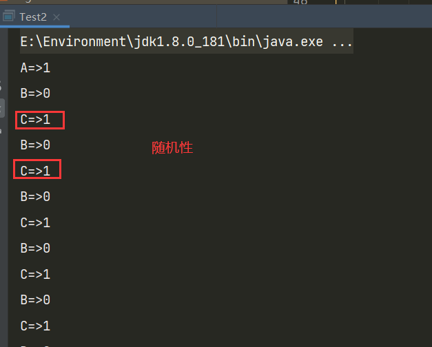.

```java
package com.du.ProducerConsumer;

import java.util.concurrent.locks.Condition;
import java.util.concurrent.locks.Lock;
import java.util.concurrent.locks.ReentrantLock;

public class Test3 {
    public static void main(String[] args) {
        Data3 data = new Data3();

        new Thread(() -> {
            for (int i = 0; i < 10; i++) {
                data.printA();
            }
        }, "A").start();

        new Thread(() -> {
            for (int i = 0; i < 10; i++) {
                data.printB();
            }
        }, "B").start();

        new Thread(() -> {
            for (int i = 0; i < 10; i++) {
                data.printC();
            }
        }, "C").start();

    }
}

class Data3 {
    private Lock lock = new ReentrantLock();

    private Condition condition1 = lock.newCondition();
    private Condition condition2 = lock.newCondition();
    private Condition condition3 = lock.newCondition();

    private int number = 0;

    public void printA() {
        lock.lock();
        try {
            //业务
            while (number != 0) {
                condition1.await();
            }
            System.out.println(Thread.currentThread().getName() + "=>AAAAAAAAAAA");
            number = 1;
            //精准唤醒
            condition2.signal();
        } catch (Exception e) {
            e.printStackTrace();
        } finally {
            lock.unlock();
        }
    }

    public void printB() {
        lock.lock();
        try {
            //业务
            while (number != 1) {
                condition2.await();
            }
            System.out.println(Thread.currentThread().getName() + "=>BBBBBBBBBBB");
            number = 2;
			//精准唤醒
            condition3.signal();
        } catch (Exception e) {
            e.printStackTrace();
        } finally {
            lock.unlock();
        }
    }

    public void printC() {
        lock.lock();
        try {
            //业务
            while (number != 2) {
                condition3.await();
            }
            System.out.println(Thread.currentThread().getName() + "=>CCCCCCCCCCC");
            number = 0;
            //精准唤醒
            condition1.signal();
        } catch (Exception e) {
            e.printStackTrace();
        } finally {
            lock.unlock();
        }
    }
}
```

# 5、8锁现象

>    static synchronized是**类锁**，synchronized是**对象锁**

**对象锁**（又称实例锁，`synchronized`）：该锁针对的是该实例对象（当前对象）。
 `synchronized`是对类的**当前实例（当前对象）**进行加锁，防止其他线程同时访问该类的**该实例的所有synchronized块**，注意这里是“类的当前实例”， 类的两个不同实例就没有这种约束了。
 **每个对象都有一个锁，且是唯一的**。

**类锁**（又称全局锁，`static synchronized`）：该锁针对的是类，无论**实例**出多少个**对象**，那么线程依然共享该锁。
 `static synchronized`是限制多线程中该类的所有实例同时访问该类**所对应的代码块**。（`实例.fun`实际上相当于`class.fun`）


关于锁的8个问题

```java
package com.du.lock8;

import java.util.concurrent.TimeUnit;

/**
 * 8锁，关于锁的八个问题
 * 1、标准情况下，两个线程谁先执行 发短信，打电话         1/发短信 2/打电话
 * 2、sendSms延迟4秒下，两个线程谁先执行 发短信，打电话         1/发短信 2/打电话
 * */
public class Test1 {
    public static void main(String[] args) {
        Phone phone = new Phone();

        // 锁的存在
        new Thread(() -> phone.sendSms(),"A").start();

        try {
            TimeUnit.SECONDS.sleep(1);
        } catch (InterruptedException e) {
            e.printStackTrace();
        }

        new Thread(() -> phone.call(),"B").start();


    }
}

class Phone{

    //synchronized 锁的对象是方法的调用者
    //两个方法是同一个锁，谁先拿到谁先执行

    public synchronized void sendSms(){
        try {
            TimeUnit.SECONDS.sleep(1);
        } catch (InterruptedException e) {
            e.printStackTrace();
        }
        System.out.println("发短信");
    }
    public synchronized void call(){
        System.out.println("打电话");
    }
}
```

```java
package com.du.lock8;

import java.util.concurrent.TimeUnit;

/**
 * 8锁，关于锁的八个问题
 * 3、增加一个普通方法，先执行哪个   1/普通方法 2/发短信
 * 4、两个方法，两个同步方法   先发短信还是打电话    //打电话
 */
public class Test2 {
    public static void main(String[] args) {
        //两个对象，两个调用者，两把锁！
        Phone2 phone1 = new Phone2();
        Phone2 phone2 = new Phone2();

        // 锁的存在
        new Thread(() -> phone1.sendSms(),"A").start();

        try {
            TimeUnit.SECONDS.sleep(1);
        } catch (InterruptedException e) {
            e.printStackTrace();
        }

        //new Thread(() -> phone.hello(),"B").start();
        new Thread(() -> phone2.call(),"B").start();


    }
}

class Phone2{

    //synchronized 锁的对象是方法的调用者
    //两个方法是同一个锁，谁先拿到谁先执行

    public synchronized void sendSms(){
        try {
            TimeUnit.SECONDS.sleep(4);
        } catch (InterruptedException e) {
            e.printStackTrace();
        }
        System.out.println("发短信");
    }
    public synchronized void call(){
        System.out.println("打电话");
    }

    // 这里没有锁！不是同步方法，不受锁的影响
    public void hello(){
        System.out.println("say hello");
    }
}
```

```java
package com.du.lock8;

import java.util.concurrent.TimeUnit;

/**
 * 8锁，关于锁的八个问题
 * 5、增加两个静态方法哪个先执行       1/发短信  2/打电话
 * 6、两个对象!增加两个静态的同步方法。      1/发短信   2/打电话
 */
public class Test3 {
    public static void main(String[] args) {
        //两个对象，两个调用者，两把锁！
        Phone3 phone1 = new Phone3();
        Phone3 phone2 = new Phone3();

        // 锁的存在
        new Thread(() -> phone1.sendSms(),"A").start();

        try {
            TimeUnit.SECONDS.sleep(1);
        } catch (InterruptedException e) {
            e.printStackTrace();
        }
        new Thread(() -> phone2.call(),"B").start();
    }
}

class Phone3{

    //synchronized 锁的对象是方法的调用者
    // static静态方法
    // 类一加载就有了！锁的是class
    public static synchronized void sendSms(){
        try {
            TimeUnit.SECONDS.sleep(4);
        } catch (InterruptedException e) {
            e.printStackTrace();
        }
        System.out.println("发短信");
    }
    public static synchronized void call(){
        System.out.println("打电话");
    }

}
```

```java
package com.du.lock8;

import java.util.concurrent.TimeUnit;

/**
 * 8锁，关于锁的八个问题
 * 7、一个静态同步方法，一个普通同步方法，一个对象       1/打电话  2/发短信
 * 8、一个静态同步方法，一个普通同步方法，两个对象       1/打电话  2/发短信
 */
public class Test4 {
    public static void main(String[] args) {
        //两个对象，两个调用者，两把锁！
        Phone4 phone1 = new Phone4();
        Phone4 phone2 = new Phone4();

        // 锁的存在
        new Thread(() -> phone1.sendSms(), "A").start();

        try {
            TimeUnit.SECONDS.sleep(1);
        } catch (InterruptedException e) {
            e.printStackTrace();
        }
        
        new Thread(() -> phone2.call(), "B").start();
    }
}

class Phone4 {

    // 静态同步方法
    public static synchronized void sendSms() {
        try {
            TimeUnit.SECONDS.sleep(4);
        } catch (InterruptedException e) {
            e.printStackTrace();
        }
        System.out.println("发短信");
    }

    // 普通同步方法
    public synchronized void call() {
        System.out.println("打电话");
    }

}
```

# 6、集合类不安全

>   list

```java
List<String> list = Arrays.asList("1","2","3");
list.forEach(System.out::println);

System.out是一个PrintStream实例的引用；System.out::println 是对一个实例方法的引用
该引用同时指定了对实例（System.out）的引用以及对方法（PrintStream::println）的引用
System.out::println 不是 System.out.println 的等价物；前者是一个方法引用表达式，而后者不能单独作为一个表达式，而必须在后面跟上由圆括号包围的参数列表来构成方法调用表达式。
System.out::println 可以看作 lambda表达式 e -> System.out.println(e) 的缩写形式。
```

```java
package com.du.unsafe;

import java.util.*;
import java.util.concurrent.CopyOnWriteArrayList;
import java.util.concurrent.TimeUnit;

public class ListTest {
    public static void main(String[] args) {
        /*
        *  并发下 ArrayList 不安全的，Synchronization
        *  java.util.ConcurrentModificationException并发修改异常，解决方案
        *  1、List<String> list = new Vector<>();
        *  2、List<String> list = Collections.synchronizedList(new ArrayList<>());
        *  3、List<String> list = new CopyOnWriteArrayList<>();
        * */

        //List<String> list = new Vector<>();
        //List<String> list = Collections.synchronizedList(new ArrayList<>());

        /*  CopyOnWrite 写入时复制  COW  计算机程序设计领域的一种优化策略
        *   多个线程调用的时候，List，读取的时候固定的，写入(覆盖)
        *   再写入的时候避免覆盖，造成数据问题
        *   读写分离
        *   CopyOnWriteArrayList 使用的lock锁，Vector使用的synchronized关键字
        * */

        List<String> list = new CopyOnWriteArrayList<>();
        for (int i = 1; i <= 10; i++) {
            new Thread(()->{
                list.add(UUID.randomUUID().toString().substring(0,5));
                System.out.println(list);
                try {
                    TimeUnit.SECONDS.sleep(1);
                } catch (InterruptedException e) {
                    e.printStackTrace();
                }
            },String.valueOf(i)).start();
        }
    }
}
```

>   set

```java
package com.du.unsafe;

import java.util.Set;
import java.util.UUID;
import java.util.concurrent.CopyOnWriteArraySet;
import java.util.concurrent.TimeUnit;

public class SetTest {
    public static void main(String[] args) {
        //Set<String> set = new HashSet<>();
        //Set<String> set = Collections.synchronizedSet(new HashSet<>());
        Set<String> set = new CopyOnWriteArraySet<>();

        for (int i = 1; i <= 100; i++) {
            new Thread(()->{
                set.add(UUID.randomUUID().toString().substring(0,5));
                System.out.println(set);
                try {
                    TimeUnit.SECONDS.sleep(1);
                } catch (InterruptedException e) {
                    e.printStackTrace();
                }
            },String.valueOf(i)).start();
        }
    }
}
```

HashSet的底层

```java
public HashSet() {
    map = new HashMap<>();
}

//add set 本质就是map的key，map的key是无法重复的，从而实现set无重复元素
//private static final Object PRESENT = new Object();   PRESENT不变的值
public boolean add(E e) {
        return map.put(e, PRESENT)==null;
}
```

>   Map


# 7、Callable

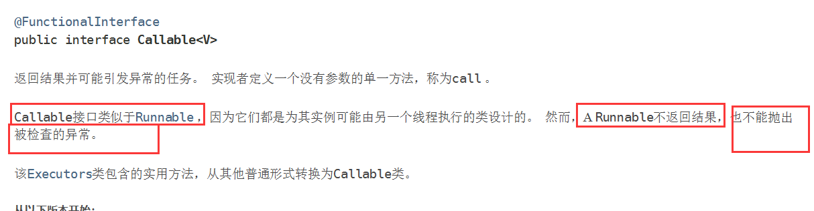

1.  方法不同，不是run()，是call()
2.  有返回值
3.  能抛出被检查的异常

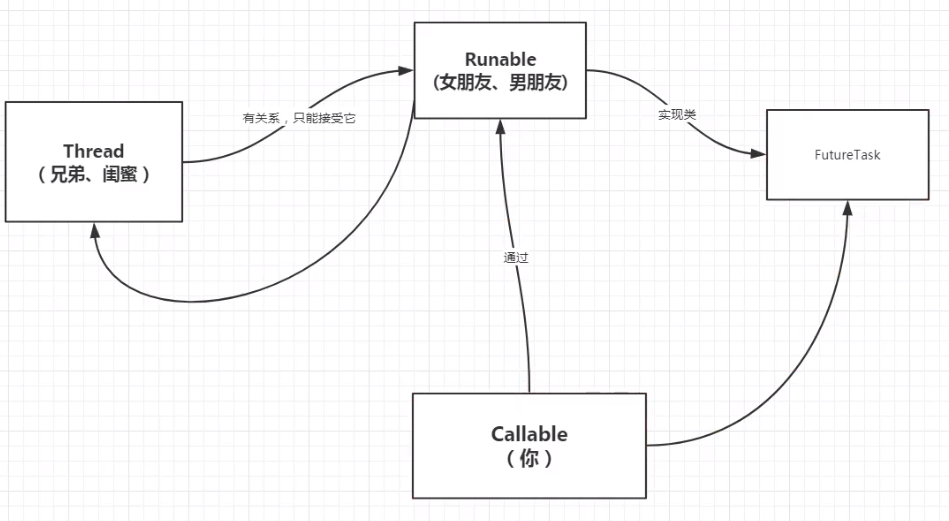


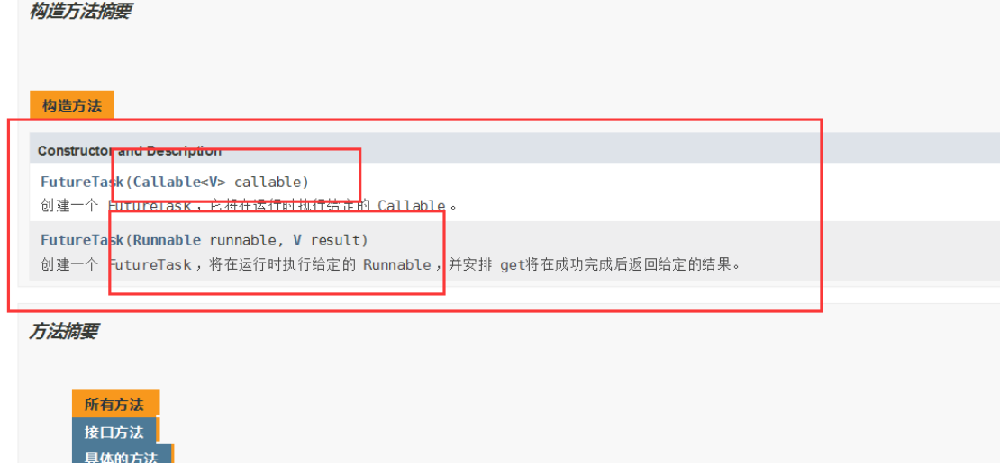

```java
package com.du.callable;

import java.util.concurrent.Callable;
import java.util.concurrent.ExecutionException;
import java.util.concurrent.FutureTask;

public class CallableTest {
    public static void main(String[] args) throws ExecutionException, InterruptedException {
        //new Thread(new Runnable()).start();
        //new Thread(new FutureTask<v>().start();
        //new Thread(new FutureTask<MyCallable>(new MyCallable())).start();
        MyCallable callable = new MyCallable();
        FutureTask task = new FutureTask(callable);

        new Thread(task).start();
        //结果会被缓存，效率高
        new Thread(task).start();

        //这个get 方法可能会产生阻塞！把他放到最后，或者使用异步通信来处理
        Integer num = (Integer) task.get();

        System.out.println(num);
    }
}

class MyCallable implements Callable<Integer>{

    @Override
    public Integer call() throws Exception {
        System.out.println("call()");
        return 1024;
    }
}
```

细节：

1.  有缓存
2.  结果可能有等待，会阻塞

# 8、常用的辅助类

## 8.1、CountDownLatch

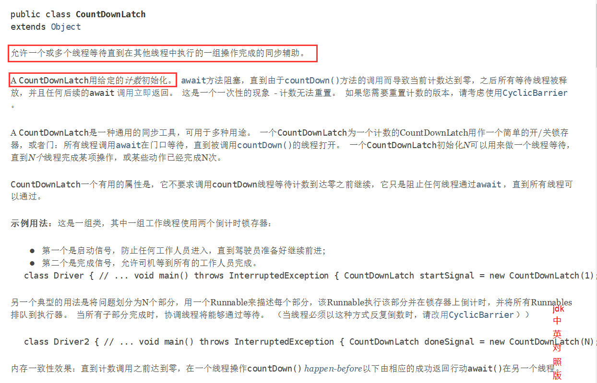

减法计数器

```java
package com.du.commonly_used_class;

import java.util.concurrent.CountDownLatch;

//计数器
public class CountDownLatchDemo {
    public static void main(String[] args) throws InterruptedException {
        //总数是6,必须要执行的任务的时候，再使用
        CountDownLatch count = new CountDownLatch(6);

        for (int i = 1; i <= 6; i++) {
            new Thread(() -> {
                System.out.println(Thread.currentThread().getName() + " Go Out");
                //倒计时-1
                count.countDown();
            }, String.valueOf(i)).start();
        }

        //等待计数器归0
        count.await();
        System.out.println("Close Door");

    }
}
```

原理：

`count.countDown();`计数器-1

`count.await();`等待计数器归0，执行任务

每次有线程调用countDown()方法数量-1，await()被唤醒，继续执行

## 8.2、CyclicBarrier

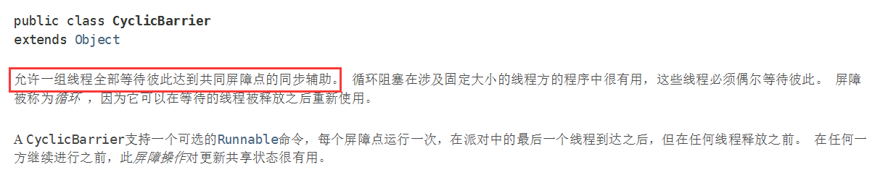

```java
package com.du.commonly_used_class;

import java.util.concurrent.BrokenBarrierException;
import java.util.concurrent.CyclicBarrier;

public class CyclicBarrierDemo {
    public static void main(String[] args) {
        CyclicBarrier barrier = new CyclicBarrier(7,()-> System.out.println("执行完成！！！"));

        for (int i = 1; i <= 7; i++) {
            final int temp = i;
            new Thread(()->{
                System.out.println(Thread.currentThread().getName() + "->执行任务" + temp);
                try {
                    barrier.await();
                } catch (InterruptedException e) {
                    e.printStackTrace();
                } catch (BrokenBarrierException e) {
                    e.printStackTrace();
                }
            },String.valueOf(i)).start();
        }
    }
}
```

## 8.3、Semaphore

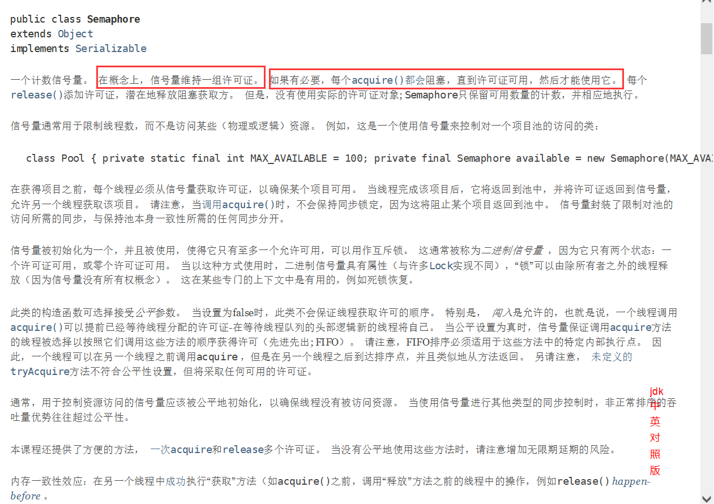

```java
package com.du.commonly_used_class;

import java.util.concurrent.Semaphore;
import java.util.concurrent.TimeUnit;

public class SemaphoreDemo {
    public static void main(String[] args) {
        //线程数量：停车位！限流！
        Semaphore semaphore = new Semaphore(3);

        for (int i = 1; i <= 6; i++) {
            new Thread(() -> {
                try {
                    //获得
                    semaphore.acquire();

                    System.out.println(Thread.currentThread().getName() + "抢到车位。");
                    TimeUnit.SECONDS.sleep(2);

                    System.out.println(Thread.currentThread().getName() + "离开车位。");
                } catch (InterruptedException e) {
                    e.printStackTrace();
                }finally {
                    //释放，在finally调用release方法防止阻塞
                    semaphore.release();
                }
            }, String.valueOf(i)).start();
        }

    }
}
```

**原理**

`semaphore.acquire();` 	获得，如果满了就等待，等待被释放为止

`semahore.release();`       释放，唤醒等待的线程

作用：多个共享资源互斥的使用，并发限流，控制最大线程数，高并发、高可用

# 9、读写锁

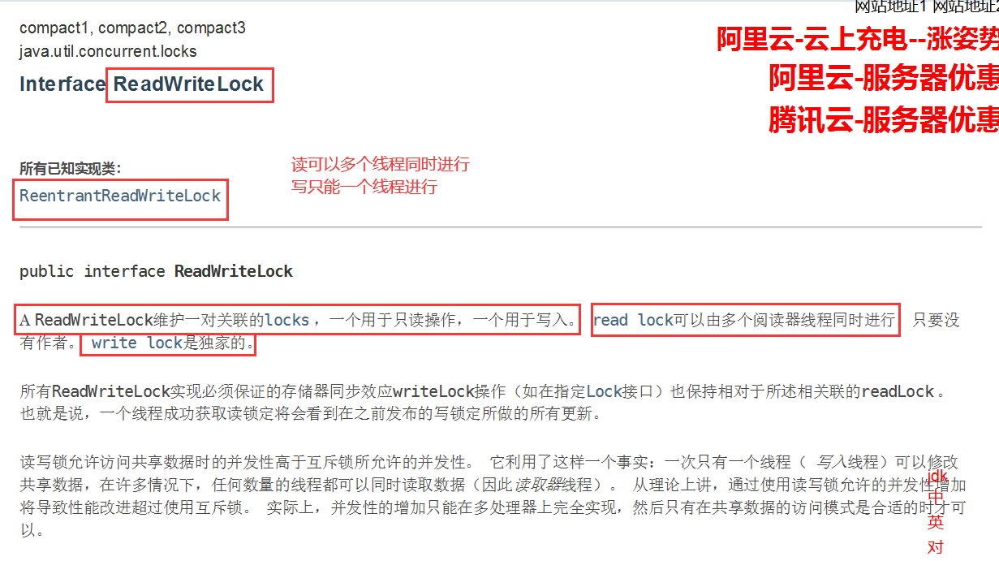

```java
package com.du.readwritelock;

import java.util.HashMap;
import java.util.Map;
import java.util.concurrent.locks.ReadWriteLock;
import java.util.concurrent.locks.ReentrantReadWriteLock;

/**
 * 独占锁（写锁） 一次只能被一个线程占有
 * 共享锁（读锁） 多个线程可以同时占有
 * ReadWriteLock
 * 读-读 可以共存！
 * 读-写 不能共存！
 * 写-写 不能共存！
 */
public class ReadWriteLockDemo {
    public static void main(String[] args) {
        ReentrantCache myCache = new ReentrantCache();

        //写入
        for (int i = 0; i < 5; i++) {
            final int temp = i;
            new Thread(() -> {
                myCache.put(String.valueOf(temp), String.valueOf(temp));
            }, String.valueOf(i)).start();
        }

        //读取
        for (int i = 0; i < 5; i++) {
            final int temp = i;
            new Thread(() -> {
                myCache.get(String.valueOf(temp));
            }, String.valueOf(i)).start();
        }

    }
}

class ReentrantCache {
    private volatile Map<String, Object> map = new HashMap<>();

    //读写锁：更加细粒度的控制
    private ReadWriteLock reentrantLock = new ReentrantReadWriteLock();

    //put，写只能有一个线程在写
    public void put(String key, Object value) {
        reentrantLock.writeLock().lock();

        try {
            System.out.println("写入->" + key);
            map.put(key, value);
            System.out.println("写入->" + key + " OK");
        } catch (Exception e) {
            e.printStackTrace();
        } finally {
            reentrantLock.writeLock().unlock();
        }

    }

    //get，读可以多个线程同时在读
    public void get(String key) {
        //加锁
        reentrantLock.readLock().lock();
        try {
            System.out.println("读取->" + key);
            map.get(key);
            System.out.println("读取->" + key + " OK");
        } catch (Exception e) {
            e.printStackTrace();
        } finally {
            //解锁
            reentrantLock.readLock().unlock();
        }
    }

}

/*
 * 无锁的自定义缓存
 * */
class MyCache {
    private volatile Map<String, Object> map = new HashMap();

    //put
    public void put(String key, Object value) {
        System.out.println("写入->" + key);
        map.put(key, value);
        System.out.println("写入->" + key + " OK");
    }

    //get
    public void get(String key) {
        System.out.println("读取->" + key);
        map.get(key);
        System.out.println("读取->" + key + " OK");
    }

}
```

# 10、阻塞队列

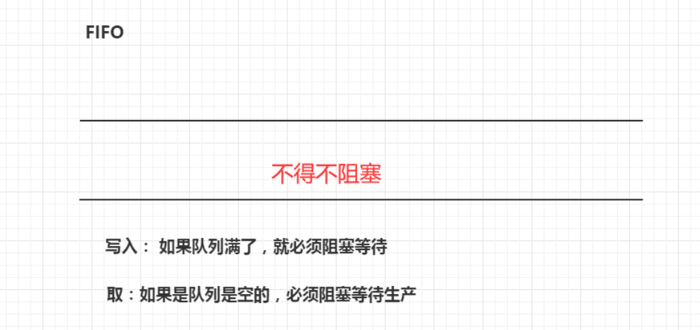

阻塞队列：

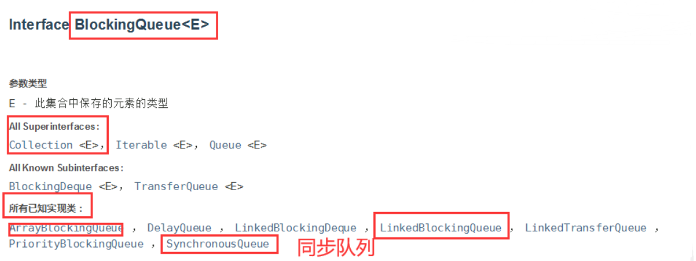

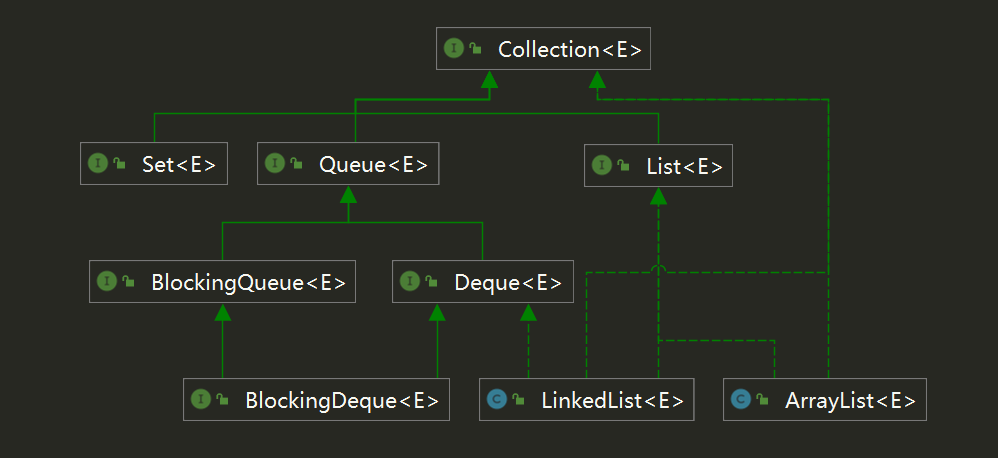


什么情况下我们会使用 阻塞队列：多线程并发处理，线程池！

添加、移除

**四组API**

| 方式         | 抛出异常 | 有返回值，不抛出异常 | 阻塞 等待 | 超时等待  |
| ------------ | -------- | -------------------- | --------- | --------- |
| 添加         | add      | offer()              | put()     | offer(,,) |
| 移除         | remove   | poll()               | take()    | poll(,)   |
| 检测队首元素 | element  | peek                 | -         | -         |

1.  抛出异常
2.  不抛出异常
3.  阻塞等待
4.  超时等待

```java
package com.du.BlockingQueue;

import java.util.concurrent.ArrayBlockingQueue;
import java.util.concurrent.TimeUnit;

public class Test {
    public static void main(String[] args) throws InterruptedException {
        test1();
        test2();
        test3();
        test4();
    }

    /**
     *
     */
    public static void test1() {
        // 队列的大小
        ArrayBlockingQueue blockingQueue = new ArrayBlockingQueue<>(3);
        System.out.println(blockingQueue.add("a"));
        System.out.println(blockingQueue.add("b"));
        System.out.println(blockingQueue.add("c"));
        // IllegalStateException: Queue full 抛出异常！
        // System.out.println(blockingQueue.add("d"));
        System.out.println("=-===========");
        System.out.println(blockingQueue.remove());
        System.out.println(blockingQueue.remove());
        System.out.println(blockingQueue.remove());
        // java.util.NoSuchElementException 抛出异常！
        // System.out.println(blockingQueue.remove());
    }

    /**
     * 有返回值，没有异常
     */
    public static void test2() {
        // 队列的大小
        ArrayBlockingQueue blockingQueue = new ArrayBlockingQueue<>(3);
        System.out.println(blockingQueue.offer("a"));
        System.out.println(blockingQueue.offer("b"));
        System.out.println(blockingQueue.offer("c"));
        // System.out.println(blockingQueue.offer("d")); // false 不抛出异常！
        System.out.println("============================");
        System.out.println(blockingQueue.poll());
        System.out.println(blockingQueue.poll());
        System.out.println(blockingQueue.poll());
        System.out.println(blockingQueue.poll()); // null 不抛出异常！
    }

    /**
     * 等待，阻塞（一直阻塞）
     *
     * @throws InterruptedException
     */
    public static void test3() throws InterruptedException {
        // 队列的大小
        ArrayBlockingQueue blockingQueue = new ArrayBlockingQueue<>(3);
        // 一直阻塞
        blockingQueue.put("a");
        blockingQueue.put("b");
        blockingQueue.put("c");
        // blockingQueue.put("d"); // 队列没有位置了，一直阻塞
        System.out.println(blockingQueue.take());
        System.out.println(blockingQueue.take());
        System.out.println(blockingQueue.take());
        System.out.println(blockingQueue.take()); // 没有这个元素，一直阻塞
    }


    /**
     * 等待，阻塞（等待超时）
     *
     * @throws InterruptedException
     */
    public static void test4() throws InterruptedException {
        // 队列的大小
        ArrayBlockingQueue blockingQueue = new ArrayBlockingQueue<>(3);
        blockingQueue.offer("a");
        blockingQueue.offer("b");
        blockingQueue.offer("c");
        // blockingQueue.offer("d",2,TimeUnit.SECONDS); // 等待超过2秒就退出
        System.out.println("===============");
        System.out.println(blockingQueue.poll());
        System.out.println(blockingQueue.poll());
        System.out.println(blockingQueue.poll());
        blockingQueue.poll(2, TimeUnit.SECONDS); // 等待超过2秒就退出
    }
}
```

>   SynchronousQueue 同步队列  

没有容量，

进去一个元素，必须等待取出来之后，才能再往里面放一个元素！

put、take  

```java
package com.du.BlockingQueue;

import java.sql.Time;
import java.util.concurrent.BlockingQueue;
import java.util.concurrent.SynchronousQueue;
import java.util.concurrent.TimeUnit;

/**
 * 同步队列
 * 和其他的BlockingQueue 不一样， SynchronousQueue 不存储元素
 * put了一个元素，必须从里面先take取出来，否则不能在put进去值！
 */
public class SynchronousQueueDemo {
    public static void main(String[] args) {
        BlockingQueue<String> blockingQueue = new SynchronousQueue<>(); // 同步队列
        
        new Thread(() -> {
            try {
                System.out.println(Thread.currentThread().getName() + " put 1");
                blockingQueue.put("1");
                System.out.println(Thread.currentThread().getName() + " put 2");
                blockingQueue.put("2");
                System.out.println(Thread.currentThread().getName() + " put 3");
                blockingQueue.put("3");
            } catch (InterruptedException e) {
                e.printStackTrace();
            }
        }, "T1").start();
        new Thread(() -> {
            try {
                TimeUnit.SECONDS.sleep(3);
                System.out.println(Thread.currentThread().getName() + "=>" + blockingQueue.take());
                TimeUnit.SECONDS.sleep(3);
                System.out.println(Thread.currentThread().getName() + "=>" + blockingQueue.take());
                TimeUnit.SECONDS.sleep(3);
                System.out.println(Thread.currentThread().getName() + "=>" + blockingQueue.take());
            } catch (InterruptedException e) {
                e.printStackTrace();
            }
        }, "T2").start();
    }
}
```

# 11、线程池

线程池：三大方法、7大参数、4种拒绝策略  

>   池化技术

程序的运行，本质：占用系统的资源！ 优化资源的使用！=>池化技术

线程池、连接池、内存池、对象池///..... 创建、销毁。十分浪费资源

池化技术：事先准备好一些资源，有人要用，就来我这里拿，用完之后还给我。  


**线程池的好处：**

1.  降低资源的消耗
2.  提高响应的速度
3.  方便管理

**线程复用、可以控制最大并发数、管理线程**


>   三大方法：

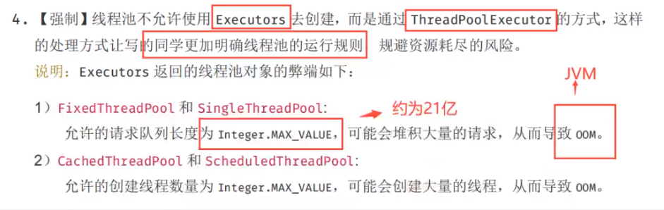

```java
//单个线程
Executors.newSingleThreadExecutor();

//创建一个固定的线程池的大小
Executors.newFixedThreadPool(5);

//可伸缩的，遇强则强，遇弱则弱，动态生成线程数
Executors.newCachedThreadPool();
```

>   7大参数

```java
public static ExecutorService newSingleThreadExecutor() {
    return new FinalizableDelegatedExecutorService
        (new ThreadPoolExecutor(1, 1,
                                0L, TimeUnit.MILLISECONDS,
                                new LinkedBlockingQueue<Runnable>()));
}

public static ExecutorService newFixedThreadPool(int nThreads) {
    return new ThreadPoolExecutor(nThreads, nThreads,
                                  0L, TimeUnit.MILLISECONDS,
                                  new LinkedBlockingQueue<Runnable>());
}

public static ExecutorService newCachedThreadPool() {
    return new ThreadPoolExecutor(0, Integer.MAX_VALUE,
                                  60L, TimeUnit.SECONDS,
                                  new SynchronousQueue<Runnable>());
}
 
//本质，实例化 ThreadPoolExecutor()

    /**
     * Creates a new {@code ThreadPoolExecutor} with the given initial
     * parameters.
     *
     * @param corePoolSize the number of threads to keep in the pool, even
     *        if they are idle, unless {@code allowCoreThreadTimeOut} is set
     * @param maximumPoolSize the maximum number of threads to allow in the
     *        pool
     * @param keepAliveTime when the number of threads is greater than
     *        the core, this is the maximum time that excess idle threads
     *        will wait for new tasks before terminating.
     * @param unit the time unit for the {@code keepAliveTime} argument
     * @param workQueue the queue to use for holding tasks before they are
     *        executed.  This queue will hold only the {@code Runnable}
     *        tasks submitted by the {@code execute} method.
     * @param threadFactory the factory to use when the executor
     *        creates a new thread
     * @param handler the handler to use when execution is blocked
     *        because the thread bounds and queue capacities are reached
     * @throws IllegalArgumentException if one of the following holds:<br>
     *         {@code corePoolSize < 0}<br>
     *         {@code keepAliveTime < 0}<br>
     *         {@code maximumPoolSize <= 0}<br>
     *         {@code maximumPoolSize < corePoolSize}
     * @throws NullPointerException if {@code workQueue}
     *         or {@code threadFactory} or {@code handler} is null
     */
public ThreadPoolExecutor(int corePoolSize, // 核心线程池大小
                          int maximumPoolSize, // 最大核心线程池大小
                          long keepAliveTime, // 超时了没有人调用就会释放
                          TimeUnit unit, // 超时单位
                          BlockingQueue<Runnable> workQueue, // 阻塞队列
                          ThreadFactory threadFactory, // 线程工厂：创建线程的，一般不用动
                          RejectedExecutionHandler handle // 拒绝策略) {
    if (corePoolSize < 0 ||
        maximumPoolSize <= 0 ||
        maximumPoolSize < corePoolSize ||
        keepAliveTime < 0)
        throw new IllegalArgumentException();
    if (workQueue == null || threadFactory == null || handler == null)
        throw new NullPointerException();
    this.acc = System.getSecurityManager() == null ?
        null :
    AccessController.getContext();
    this.corePoolSize = corePoolSize;
    this.maximumPoolSize = maximumPoolSize;
    this.workQueue = workQueue;
    this.keepAliveTime = unit.toNanos(keepAliveTime);
    this.threadFactory = threadFactory;
    this.handler = handler;
}
```

>   手写线程池

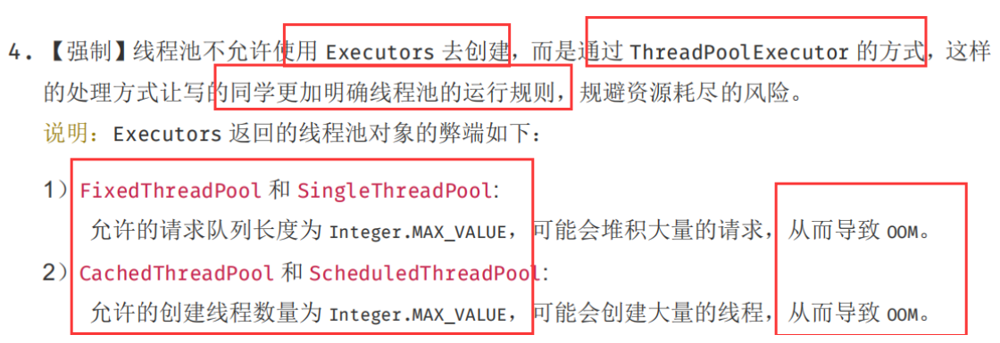

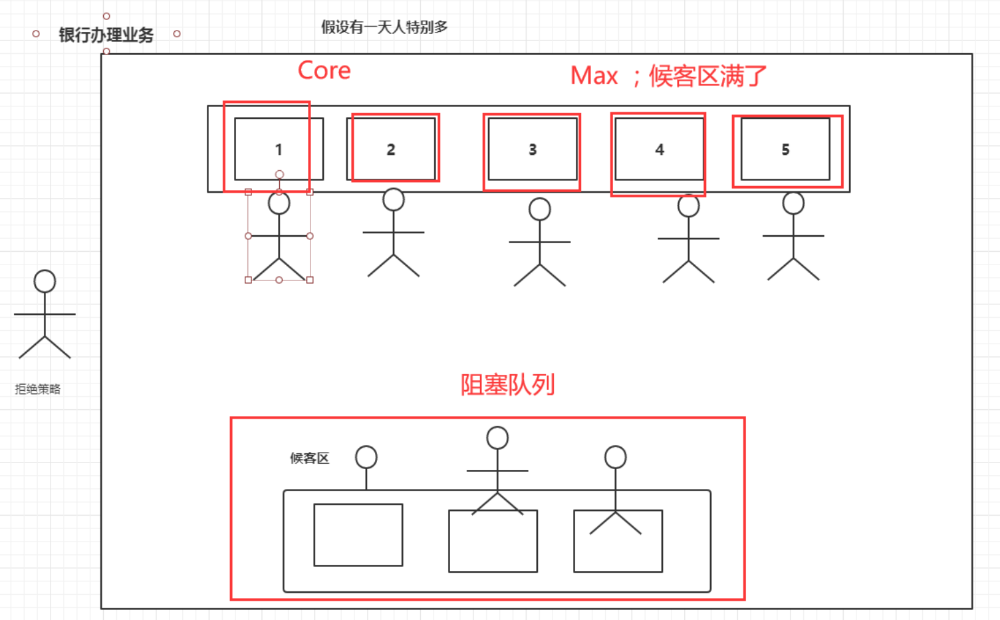

```java
package com.du.pool;

import java.util.concurrent.*;

/**
* new ThreadPoolExecutor.AbortPolicy() // 银行满了，还有人进来，不处理这个人的，抛出异常 
* new ThreadPoolExecutor.CallerRunsPolicy() // 哪来的去哪里！
* new ThreadPoolExecutor.DiscardPolicy() //队列满了，丢掉任务，不会抛出异常！
* new ThreadPoolExecutor.DiscardOldestPolicy() //队列满了，尝试去和最早的竞争，也不会
抛出异常！
*/
public class Demo02 {
    public static void main(String[] args) {
        //自定义线程池，工作种用这种方法 new ThreadPoolExecutor
        ExecutorService executor = new ThreadPoolExecutor(
                2,
                5,
                3,
                TimeUnit.SECONDS,
                new LinkedBlockingDeque<>(3),
                Executors.defaultThreadFactory(),
                //银行满了，还有人进来，不处理这个人的，抛出异常
                new ThreadPoolExecutor.AbortPolicy()
        );

        for (int i = 1; i <= 10; i++) {
            //最大承载 = max + queue
            //拒绝策略new ThreadPoolExecutor.AbortPolicy() 超出最大承载抛出异常 RejectedExecutionException
            executor.execute(()->{
                System.out.println(Thread.currentThread().getName() + " OK");
                try {
                    TimeUnit.SECONDS.sleep(1);
                } catch (InterruptedException e) {
                    e.printStackTrace();
                }
            });
        }
        //释放资源
        executor.shutdown();
    }
}
```

>   4种拒绝策略

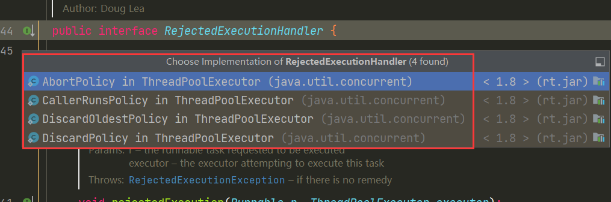

```java
/**
* new ThreadPoolExecutor.AbortPolicy() // 银行满了，还有人进来，不处理这个人的，抛出异常 
* new ThreadPoolExecutor.CallerRunsPolicy() // 哪来的去哪里！
* new ThreadPoolExecutor.DiscardPolicy() //队列满了，丢掉任务，不会抛出异常！
* new ThreadPoolExecutor.DiscardOldestPolicy() //队列满了，尝试去和最早的竞争，也不会抛出异常！，如果第一个线程结束了当前线程获得第一个线程资源
*/
```

>   池的最大的大小如何去设置(调优)

1.  CPU 密集型    几核，就是几，可以保持CPu的效率最高！  
2.  IO    密集型   > 判断你程序中十分耗IO的线程，double

程序 15个大型任务  io十分占用资源！

```java
// 获取CPU的核数
System.out.println(Runtime.getRuntime().availableProcessors());

package com.du.pool;

import java.util.concurrent.*;

public class Demo02 {
    public static void main(String[] args) {
        //最大线程到底该如何定义
        //1、CPU 密集型，几核，就是几，可以保持CPu的效率最高！
        //2、IO 密集型 >判断你程序中十分耗IO的线程，   两倍
        //程序 15 个大型任务 io十分占用资源！
        ExecutorService executor = new ThreadPoolExecutor(
                2,
                //获取CPU的核数
                Runtime.getRuntime().availableProcessors(),
                3,
                TimeUnit.SECONDS,
                new LinkedBlockingDeque<>(3),
                Executors.defaultThreadFactory(),
                new ThreadPoolExecutor.DiscardOldestPolicy()
        );

        for (int i = 1; i <= 10; i++) {
            executor.execute(() -> {
                System.out.println(Thread.currentThread().getName() + " OK");
            });
            try {
                TimeUnit.SECONDS.sleep(1);
            } catch (InterruptedException e) {
                e.printStackTrace();
            }
        }
        executor.shutdown();
    }
}
```

# 12、四大函数式接口

lambda、链式编程、函数式接口、stream流式计算

>   函数式接口：只有一个方法的接口

```java
@FunctionalInterface
public interface Runnable {
    public abstract void run();
}

//FunctionalInterface
//简化编程模型，在新版本的框架底层大量应用
//foreach(消费者类的函数式接口)
```

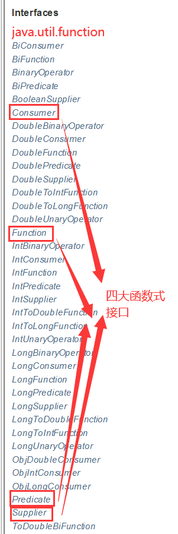 

>   函数型接口Function

```java
package com.du.function;

import java.util.function.Function;

public class Demo01 {
    public static void main(String[] args) {
        /*Function function = new Function<String, String>() {
            @Override
            public String apply(String str) {
                return str;
            }
        };*/

        Function<String, String> function = (str) -> str;

        System.out.println(function.apply("abc"));
    }
}
```

>   断定型接口predicate

有一个输入函数，返回值必须是布尔值

```java
package com.du.function;

import java.util.function.Predicate;

public class Demo02 {
    public static void main(String[] args) {
        /*Predicate<String> predicate = new Predicate<String>() {
            @Override
            public boolean test(String str) {
                return str.isEmpty();
            }
        };*/

        Predicate<String> predicate = (str) -> str.isEmpty();
        System.out.println(predicate.test(""));
    }
}
```

>   消费型接口consumer

```java
package com.du.function;

import java.util.function.Consumer;

/**
* 消费型接口 consumer，只有输入，没有返回值
*/
public class Demo03 {
    public static void main(String[] args) {
        Consumer consumer = new Consumer<String>() {
            @Override
            public void accept(String o) {
                System.out.println(o);
            }
        };
        
        consumer.accept("abc");
    }
}
```

>   供给型接口supplier

```java
package com.du.function;

import java.util.function.Supplier;

/**
 * 供给型接口 supplier，没有输入值，只有返回值
 */
public class Demo04 {
    public static void main(String[] args) {
        //Supplier supplier = new Supplier<Integer>() {
        //    @Override
        //    public Integer get() {
        //        System.out.println("进入get()");
        //        return 1024;
        //    }
        //};

        Supplier supplier = ()->{
            System.out.println("get()");
            return 1024;
        };

        System.out.println(supplier.get());

    }
}
```

# 13、stream流式计算

>   什么是stream流式计算

大数据：存储 + 计算

存储：集合、MySQL 本质（就是存储东西的）

计算：交给流来操作！  

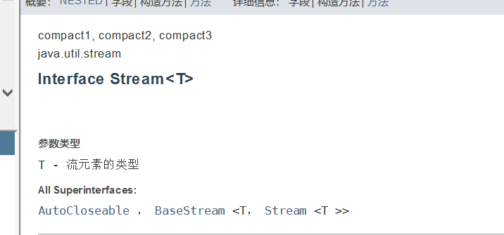

```java
package com.du.stream;

import java.util.*;

/**
 * 题目要求：一分钟内完成此题，只能用一行代码实现！
 * 现在有5个用户！筛选：
 * 1、ID 必须是偶数
 * 2、年龄必须大于23岁
 * 3、用户名转为大写字母
 * 4、用户名字母倒着排序
 * 5、只输出一个用户！
 */
public class Test {
    public static void main(String[] args) {
        Stack<Object> stack = new Stack<>();
        User u1 = new User(1, "a", 21);
        User u2 = new User(2, "b", 22);
        User u3 = new User(3, "c", 23);
        User u4 = new User(4, "d", 24);
        User u5 = new User(6, "e", 25);

        //集合存储
        List<User> list = Arrays.asList(u1, u2, u3, u4, u5);
        //集合转为流，并且计算
        list.stream()
                .filter((u) -> u.getId() % 2 == 0)
                .filter((u) -> u.getAge() > 23)
                .map((u) -> u.getName().toUpperCase())
                .sorted(Comparator.reverseOrder())
                .limit(1)
                .forEach(System.out::println);
    }
}
```

# 14、ForkJoin

>   什么是ForkJoin

ForkJoin在jdk1.7出来的，并行执行任务！提高效率，大数据量！

大数据：Map Reduce(把大任务拆分为小任务)

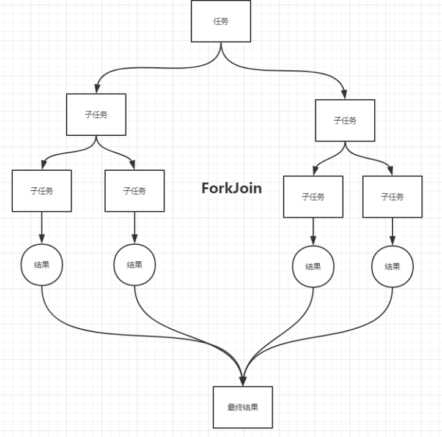

>   ForkJoin特点：工作窃取

这里面维护的都是双端队列

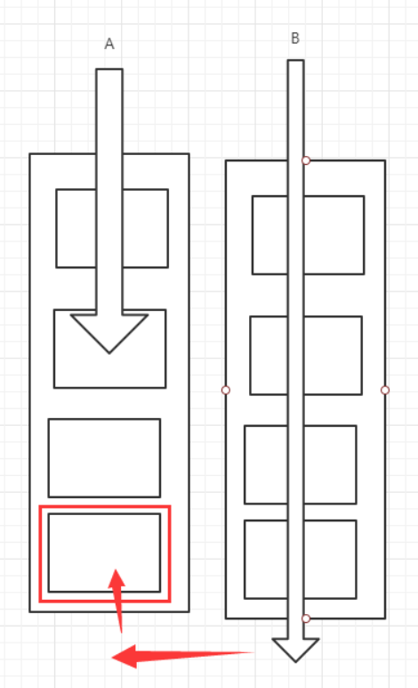

>   ForkJoin的操作


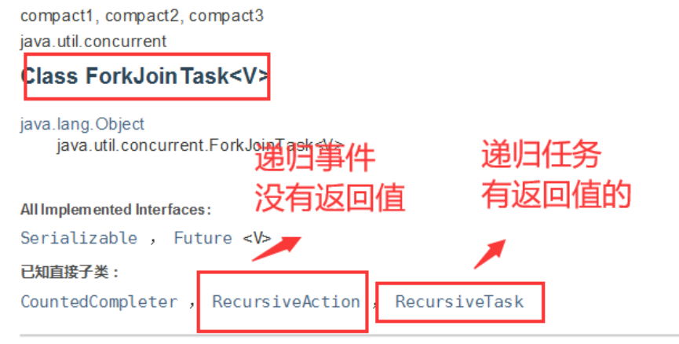

```java
package com.du.ForkJoin;

import java.util.concurrent.RecursiveTask;
/**
 * 求和计算的任务！
 * 3000 6000（ForkJoin） 9000（Stream并行流）
 * // 如何使用 forkjoin
 * // 1、forkjoinPool 通过它来执行
 * // 2、计算任务 forkjoinPool.execute(ForkJoinTask task)
 * // 3. 计算类要继承 ForkJoinTask
 */
public class ForkJoinDemo extends RecursiveTask<Long> {
    private Long start; // 1
    private Long end; // 1990900000
    // 临界值
    private Long temp = 10000L;
    public ForkJoinDemo(Long start, Long end) {
        this.start = start;
        this.end = end;
    }
    // 计算方法
    @Override
    protected Long compute() {
        if ((end-start)<temp){
            Long sum = 0L;
            for (Long i = start; i <= end; i++) {
                sum += i;
            }
            return sum;
        }else { // forkjoin 递归
            long middle = (start + end) / 2; // 中间值
            ForkJoinDemo task1 = new ForkJoinDemo(start, middle);
            task1.fork(); // 拆分任务，把任务压入线程队列
            ForkJoinDemo task2 = new ForkJoinDemo(middle+1, end);
            task2.fork(); // 拆分任务，把任务压入线程队列测试：
            return task1.join() + task2.join();
        }
    }
}
```

测试

```java
package com.du.ForkJoin;

import java.util.concurrent.ExecutionException;
import java.util.concurrent.ForkJoinPool;
import java.util.concurrent.ForkJoinTask;
import java.util.stream.LongStream;

/**
 * 同一个任务，别人效率高你几十倍！
 */
public class Test {
    public static void main(String[] args) throws ExecutionException, InterruptedException {
        test1(); // 5541
        test2(); // 4839
        test3(); // 147
    }

    // 普通程序员
    public static void test1() {
        Long sum = 0L;
        long start = System.currentTimeMillis();
        for (Long i = 1L; i <= 10_0000_0000; i++) {
            sum += i;
        }
        long end = System.currentTimeMillis();
        System.out.println("sum=" + sum + " 时间：" + (end - start));
    }

    // 会使用ForkJoin
    public static void test2() throws ExecutionException, InterruptedException {
        long start = System.currentTimeMillis();
        ForkJoinPool forkJoinPool = new ForkJoinPool();
        ForkJoinTask<Long> task = new ForkJoinDemo(0L, 10_0000_0000L);
        ForkJoinTask<Long> submit = forkJoinPool.submit(task);// 提交任务
        Long sum = submit.get();
        long end = System.currentTimeMillis();
        System.out.println("sum=" + sum + " 时间：" + (end - start));
    }

    // 会使用stream
    public static void test3() {
        long start = System.currentTimeMillis();
        // Stream并行流 () (]
        long sum = LongStream.rangeClosed(0L,
                10_0000_0000L).parallel().reduce(0, Long::sum);
        long end = System.currentTimeMillis();
        System.out.println("sum=" + "时间：" + (end - start));
    }
}
```

# 15、异步回调

>   Future

对将来的某个事件进行建模

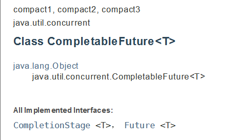 

```java
package com.du.future;

import java.util.concurrent.CompletableFuture;
import java.util.concurrent.ExecutionException;

/**
 * 异步调用： CompletableFuture
 * // 异步执行
 * // 成功回调
 * // 失败回调
 */
public class Demo1 {
    public static void main(String[] args) throws ExecutionException, InterruptedException {
        /* 没有返回值的 runAsync 异步回调
        CompletableFuture<Void> future = CompletableFuture.runAsync(() ->{
            try {
                TimeUnit.SECONDS.sleep(2);
            } catch (InterruptedException e) {
                e.printStackTrace();
            }
            System.out.println(Thread.currentThread().getName() + "=>void");
        });

        System.out.println("Hello");

        //获取阻塞执行结果
        future.get();*/

        //有返回值的 supplyAsync 异步回调
        CompletableFuture<Integer> future = CompletableFuture.supplyAsync(() -> {
            int i = 1 / 0;
            return 1024;
        });

        System.out.println(future.whenComplete((t, u) -> {
            // 正常的返回结果
            System.out.println("t=>" + t);
            // 异常信息
            System.out.println("u=>" + u);
        }).exceptionally((e) -> {
            System.out.println(e.getMessage());
            //可以获取到错误的返回结果
            return -1;
        }).get());
    }
}
```

# 16、JMM

>   三大特性

1.  原子性

    JMM只能保证基本的原子性，如果要保证一个代码块的原子性，提供了monitorenter 和 moniterexit 两个字节码指令，也就是 synchronized 关键字。因此在 synchronized 块之间的操作都是原子性的。

2.  可见性

    可见性指当一个线程修改共享变量的值，其他线程能够立即知道被修改了。Java是利用volatile关键字来提供可见性的。 当变量被volatile修饰时，这个变量被修改后会立刻刷新到主内存，当其它线程需要读取该变量时，会去主内存中读取新值。而普通变量则不能保证这一点。

    除了volatile关键字之外，final和synchronized也能实现可见性。

    synchronized的原理是，在执行完，进入unlock之前，必须将共享变量同步到主内存中。

    final修饰的字段，一旦初始化完成，如果没有对象逸出（指对象为初始化完成就可以被别的线程使用），那么对于其他线程都是可见的。

3.  有序性

    在Java中，可以使用synchronized或者volatile保证多线程之间操作的有序性。实现原理有些区别：

    volatile关键字是使用内存屏障达到禁止指令重排序，以保证有序性。

    synchronized的原理是，一个线程lock之后，必须unlock后，其他线程才可以重新lock，使得被synchronized包住的代码块在多线程之间是串行执行的。

>   Volatile

Volatile是java虚拟机提供的**轻量级的同步机制**

1.  保证可见性
2.  ==不保证原子性==
3.  禁止指令重排

>   JMM

Java内存模型

**关于JMM的一些同步的约定：**

1.  线程解锁前，必须把共享变量==**立刻**==刷回主存
2.  线程加锁前，必须读取主存中的最新值到工作内存中
3.  加锁解锁是同一把锁


线程	**工作内存、主内存**

**8种操作**

  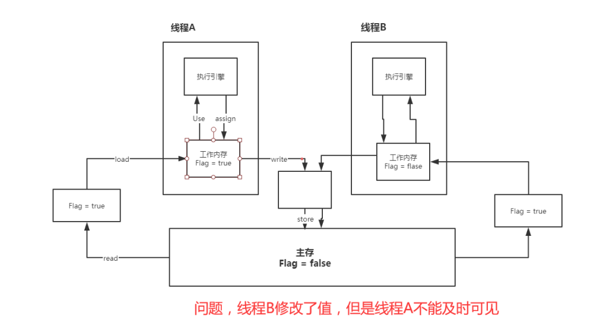

**内存交互操作有8种，虚拟机实现必须保证每一个操作都是原子的，不可在分的（对于double和long类型的变量来说，load、store、read和write操作在某些平台上允许例外）**

   -   lock   （锁定）：作用于主内存的变量，把一个变量标识为线程独占状态

   -   unlock （解锁）：作用于主内存的变量，它把一个处于锁定状态的变量释放出来，释放后的变量才可以被其他线程锁定

   -   read  （读取）：作用于主内存变量，它把一个变量的值从主内存传输到线程的工作内存中，以便随后的load动作使用

   -   load   （载入）：作用于工作内存的变量，它把read操作从主存中变量放入工作内存中

   -   use   （使用）：作用于工作内存中的变量，它把工作内存中的变量传输给执行引擎，每当虚拟机遇到一个需要使用到变量的值，就会使用到这个指令

   -   assign （赋值）：作用于工作内存中的变量，它把一个从执行引擎中接受到的值放入工作内存的变量副本中

   -   store  （存储）：作用于主内存中的变量，它把一个从工作内存中一个变量的值传送到主内存中，以便后续的write使用

   -   write 　（写入）：作用于主内存中的变量，它把store操作从工作内存中得到的变量的值放入主内存的变量中

**JMM对这八种指令的使用，制定了如下规则：**

   -   不允许read和load、store和write操作之一单独出现。即使用了read必须load，使用了store必须write
   -   不允许线程丢弃他最近的assign操作，即工作变量的数据改变了之后，必须告知主存
   -   不允许一个线程将没有assign的数据从工作内存同步回主内存
   -   一个新的变量必须在主内存中诞生，不允许工作内存直接使用一个未被初始化的变量。就是对变量实施use、store操作之前，必须经过assign和load操作
   -   一个变量同一时间只有一个线程能对其进行lock。多次lock后，必须执行相同次数的unlock才能解锁
   -   如果对一个变量进行lock操作，会清空所有工作内存中此变量的值，在执行引擎使用这个变量前，必须重新load或assign操作初始化变量的值
   -   如果一个变量没有被lock，就不能对其进行unlock操作。也不能unlock一个被其他线程锁住的变量
   -   对一个变量进行unlock操作之前，必须把此变量同步回主内存


==问题： 程序不知道主内存的值已经被修改过了==

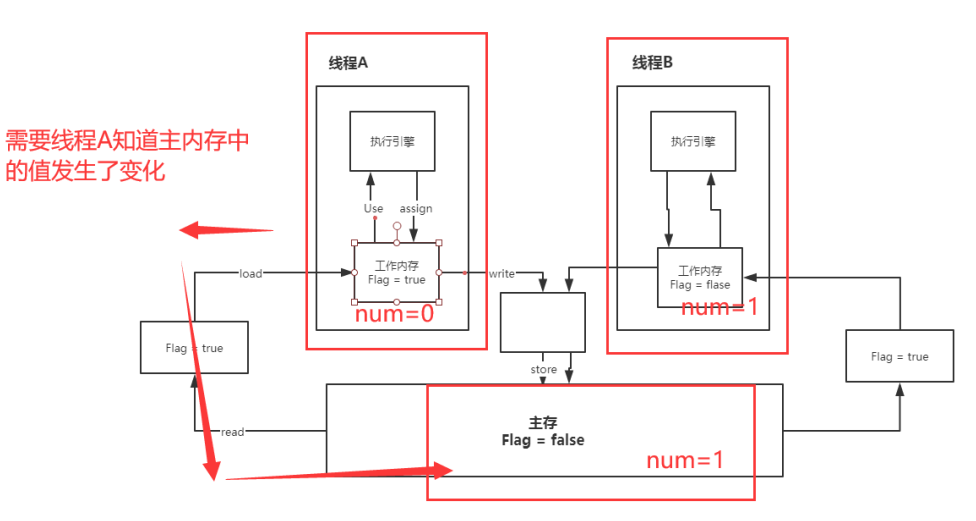

# 17、volatile

>   1、保证可见性

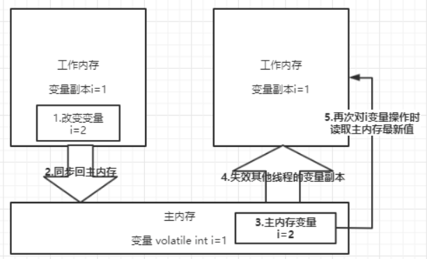

```java
package com.du.volatileTest;

import java.util.concurrent.TimeUnit;

public class JmmDemo1 {

    //不加volatile程序会死循环
    private volatile static int num = 0;

    //main线程
    public static void main(String[] args) {

        //线程1对主内存的变化不可见，需要添加volatile
        new Thread(()->{
           while (num==0);
        });

        try {
            TimeUnit.SECONDS.sleep(1);
        } catch (InterruptedException e) {
            e.printStackTrace();
        }

        num = 1;
        System.out.println(num);

    }
}
```

>   2、不保证原子性

原子性 : 不可分割
线程A在执行任务的时候，不能被打扰的，也不能被分割。要么同时成功，要么同时失败。  

```java
package com.du.volatileTest;

public class VolatileTest1 {

    //volatile 不保证原子性
    private volatile static int num = 0;

    public static void add() {
        num++;
    }

    public static void main(String[] args) {
        for (int i = 0; i < 20; i++) {
            new Thread(() -> {
                for (int j = 0; j < 1000; j++) {
                    add();
                }
            }).start();
        }

        //main，gc线程默认一直执行
        while (Thread.activeCount() > 2) Thread.yield();

        //num极低概率为20000
        //volatile不能保证原子性
        System.out.println(Thread.currentThread().getName() + "---------->" + num);
    }
}
```

==如果不加 lock 和 synchronized 怎么保证原子性==

num++不是原子性操作

```bash
#windows 10 cmd命令	javap反编译
#javap -c VolatileTest1
javap <options> <classes>
```

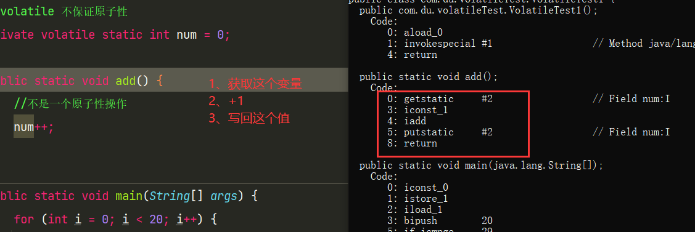

**使用原子类，解决原子性问题**

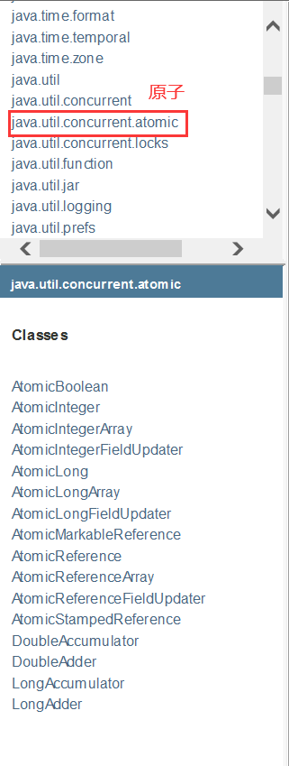 

```java
package com.du.volatileTest;

import java.util.concurrent.atomic.AtomicInteger;

public class VolatileTest1 {

    //volatile 不保证原子性
    private volatile static AtomicInteger num = new AtomicInteger();

    public static void add() {
        //不是一个原子性操作
        //num++;
        //AtomicInteger + 1 方法，CAS
        num.getAndIncrement();
    }

    public static void main(String[] args) {
        for (int i = 0; i < 20; i++) {
            new Thread(() -> {
                for (int j = 0; j < 1000; j++) {
                    add();
                }
            }).start();
        }

        //main，gc线程默认一直执行
        while (Thread.activeCount() > 2) Thread.yield();

        System.out.println(Thread.currentThread().getName() + "---------->" + num);
    }
}
```

这些类的底层都是直接跟操作系统挂钩，直接在内存中修改值！Unsafe类

>   指令重排

什么是指令重排：**你写的程序，计算机并不是按你想要的那样去执行的。**

重排序的种类分为三种，分别是：编译器重排序，指令级并行的重排序，内存系统重排序。

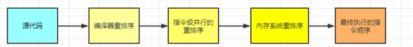

==处理器在进行指令重排的时候，考虑：数据之间的依赖性！==

```java
int x = 1; // 1
int y = 2; // 2
x = x + 5; // 3
y = x * x; // 4
我们所期望的：1234 但是可能执行的时候回变成 2134 1324
不可能是 4123！
```

可能造成影响的结果： a b x y 这四个值默认都是 0；  

| 线程A | 线程B |
| ----- | ----- |
| x=a   | y=b   |
| b=1   | a=2   |

正常的结果： x = 0；y = 0；但是可能由于指令重排  

| 线程A | 线程B |
| ----- | ----- |
| b=1   | a=2   |
| x=a   | y=b   |

指令重排导致的诡异结果： x = 2；y = 1；  

**volatile可以避免指令重排**

volatile关键字禁止指令重排序有两层意思：

-   当程序执行到volatile变量的读操作或者写操作时，在其前面的操作的更改肯定全部已经进行，且结果已经对后面的操作可见，在其后面的操作肯定还没有进行。
-   在进行指令优化时，不能将在对volatile变量访问的语句放在其后面执行，也不能把volatile变量后面的语句放到其前面执行。

内存屏障。CPU指令，作用：

1.  保证特定的操作的执行顺序
2.  可以保证某些变量的内存可见性(利用这些特性volatile实现了可见性)

首先要讲一下内存屏障，内存屏障可以分为以下几类：

-   LoadLoad 屏障：对于这样的语句Load1，LoadLoad，Load2。在Load2及后续读取操作要读取的数据被访问前，保证Load1要读取的数据被读取完毕。
-   StoreStore屏障：对于这样的语句Store1， StoreStore， Store2，在Store2及后续写入操作执行前，保证Store1的写入操作对其它处理器可见。
-   LoadStore 屏障：对于这样的语句Load1， LoadStore，Store2，在Store2及后续写入操作被刷出前，保证Load1要读取的数据被读取完毕。
-   StoreLoad 屏障：对于这样的语句Store1， StoreLoad，Load2，在Load2及后续所有读取操作执行前，保证Store1的写入对所有处理器可见。

在每个volatile读操作后插入LoadLoad屏障，在读操作后插入LoadStore屏障。

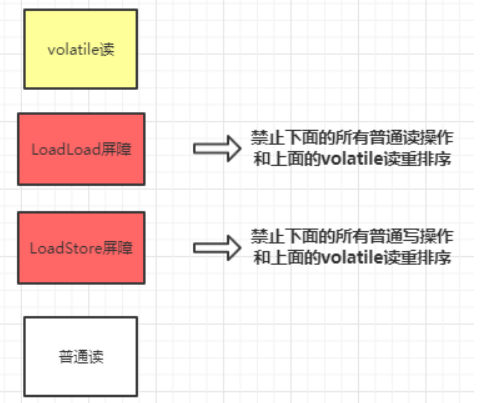

在每个volatile写操作的前面插入一个StoreStore屏障，后面插入一个SotreLoad屏障。

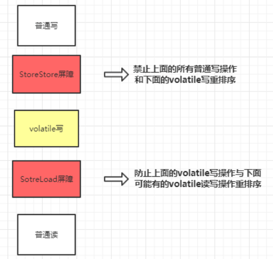

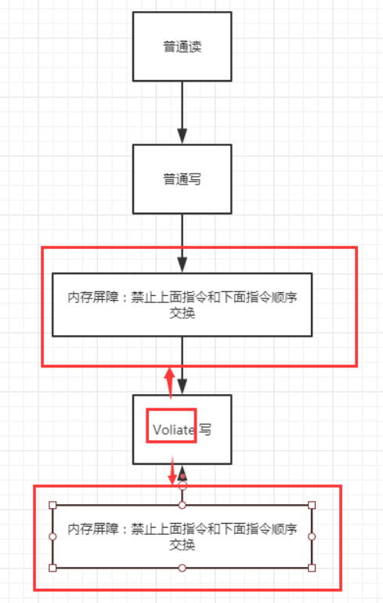

**Volatile 是可以保持 可见性。不能保证原子性，由于内存屏障，可以保证避免指令重排的现象产生！**

# 18、单例模式

饿汉式、DCL懒汉式

>   饿汉式

```java
package com.du.single;

// 饿汉式单例
public class Hungry {
    
    // 可能会浪费空间
    private byte[] data1 = new byte[1024 * 1024];
    private byte[] data2 = new byte[1024 * 1024];
    private byte[] data3 = new byte[1024 * 1024];
    private byte[] data4 = new byte[1024 * 1024];

    private Hungry() {
    }

    private final static Hungry HUNGRY = new Hungry();

    public static Hungry getInstance() {
        return HUNGRY;
    }
}
```

>   DCL懒汉式

```java
package com.du.single;

import java.lang.reflect.Constructor;
import java.lang.reflect.Field;

// 懒汉式单例
// 道高一尺，魔高一丈！
public class LazyMan {

    private static boolean qinjiang = false;

    private LazyMan() {
        synchronized (LazyMan.class) {
            if (qinjiang == false) {
                qinjiang = true;
            } else {
                throw new RuntimeException("不要试图使用反射破坏异常");
            }
        }
    }

    private volatile static LazyMan lazyMan;

    // 双重检测锁模式的 懒汉式单例 DCL懒汉式
    public static LazyMan getInstance() {
        if (lazyMan == null) {
            synchronized (LazyMan.class) {
                if (lazyMan == null) {
                    lazyMan = new LazyMan(); // 不是一个原子性操作
                    /*
                    * 1、分配内存空间
                    * 2、执行构造方法，初始化对象
                    * 3、把这个对象指向这个空间
                    *
                    * 指令重排
                    * 132 线程A
                    *     线程B 此时lazyMan还没有初始化，但是已经分配了空间，lazyMan != null
                    *
                    * */
                }
            }
        }
        return lazyMan;
    }

    // 反射！
    public static void main(String[] args) throws Exception {
        // LazyMan instance = LazyMan.getInstance();
        Field qinjiang = LazyMan.class.getDeclaredField("qinjiang");
        qinjiang.setAccessible(true);
        Constructor<LazyMan> declaredConstructor =
                LazyMan.class.getDeclaredConstructor(null);
        declaredConstructor.setAccessible(true);
        LazyMan instance = declaredConstructor.newInstance();
        qinjiang.set(instance, false);
        LazyMan instance2 = declaredConstructor.newInstance();
        System.out.println(instance);
        System.out.println(instance2);
    }
}
```

==单例不安全，反射==

>   静态内部类

```java
package com.du.single;

public class Holder {

    private Holder(){
        
    }

    public static Holder getInstance(){
        return InnerClass.HOLDER;
    }

    public static class InnerClass{
        private static final Holder HOLDER = new Holder();
    }

}
```

>   enum枚举

解决单例不安全的问题

```java
package com.du.single;

import java.lang.reflect.Constructor;

// enum
public enum EnumSingle {

    INSTANCE;

    public EnumSingle getInstance(){
        return INSTANCE;
    }
}

class Test{

    public static void main(String[] args) throws Exception {
        EnumSingle instance1 = EnumSingle.INSTANCE;
        Constructor<EnumSingle> constructor = EnumSingle.class.getDeclaredConstructor(String.class, int.class);
        constructor.setAccessible(true);
        EnumSingle instance2 = constructor.newInstance();
        System.out.println(instance1);
        System.out.println(instance2);
    }

}
```

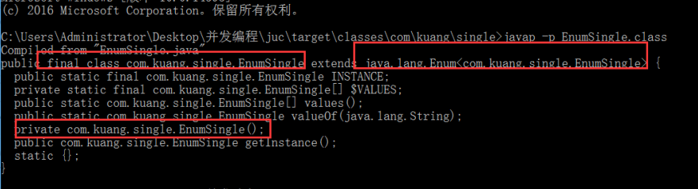

枚举反编译源码，没有无参构造方法

```java
// Decompiled by Jad v1.5.8g. Copyright 2001 Pavel Kouznetsov.
// Jad home page: http://www.kpdus.com/jad.html
// Decompiler options: packimports(3)
// Source File Name: EnumSingle.java
package com.du.single.;

public final class EnumSingle extends Enum {
    public static EnumSingle[] values() {
        return (EnumSingle[]) $VALUES.clone();
    }

    public static EnumSingle valueOf(String name) {
        return (EnumSingle) Enum.valueOf(com /du/single/EnumSingle, name);
    }

    private EnumSingle(String s, int i) {
        super(s, i);
    }

    public EnumSingle getInstance() {
        return INSTANCE;
    }

    public static final EnumSingle INSTANCE;
    private static final EnumSingle $VALUES[];

    static {
        INSTANCE = new EnumSingle("INSTANCE", 0);
        $VALUES = (new EnumSingle[]{
                INSTANCE
        });
    }
}
```

# 19、深入理解CAS

>   什么是CAS

```java
package com.du.cas;

import java.util.concurrent.atomic.AtomicInteger;

public class CASDemo {

    // CAS  compareAndSet 比较并交换
    public static void main(String[] args) {
        AtomicInteger atomicInteger = new AtomicInteger(2020);
        // 期望 更新 达到期望的值就更新
        // public final boolean compareAndSet(int expect, int update)
        // 如果期望值达到了就更新，否则不更新，CAS 是CPU的并发原语
        System.out.println(atomicInteger.compareAndSet(2020, 2021));
        System.out.println(atomicInteger.get());
        System.out.println(atomicInteger.compareAndSet(2020, 2022));
        System.out.println(atomicInteger.get());
    }
}
```

>   Unsafe

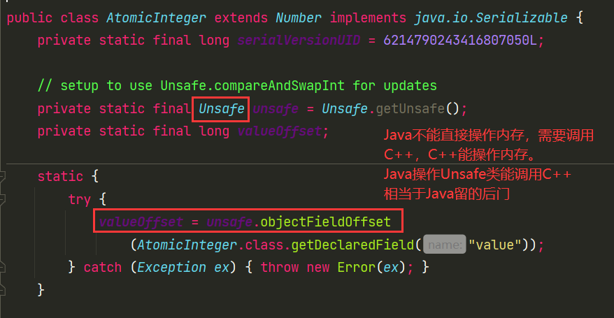

内存操作效率很高：

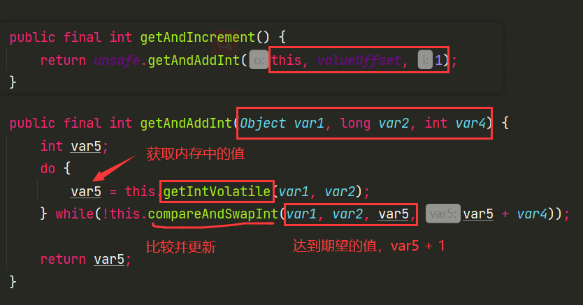

**自旋锁**

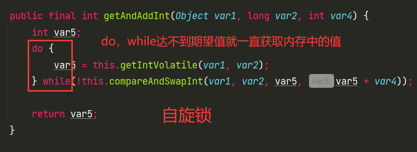

CAS：比较当前内存中的值和主内存中的值，如果这个值是期望的，就执行操作，否则不执行，如果不是就一直循环获取内存中的值

**缺点：**

1.  循环会耗时
2.  一次性只能保证一个共享变量的原子性
3.  存在ABA问题

>   CAS：ABA问题

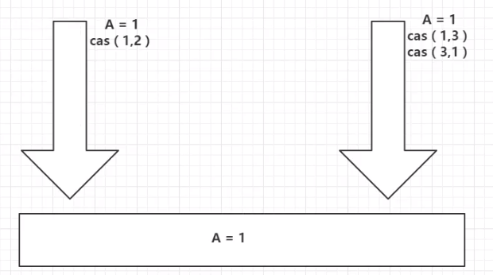

线程A期望A=1，由于线程B执行较快，先把A修改为3，又修改为1；这时线程A拿到A值，虽然A=1，但是不是之前的A值了。

```java
package com.du.cas;

import java.util.concurrent.atomic.AtomicInteger;

public class ABA {
    public static void main(String[] args) {

        // 使用乐观锁
        // 总是认为值没有改变过
        AtomicInteger atomicInteger = new AtomicInteger(2020);

        // 异常线程
        System.out.println(atomicInteger.compareAndSet(2020, 2021));
        System.out.println(atomicInteger.get());
        System.out.println(atomicInteger.compareAndSet(2021, 2020));
        System.out.println(atomicInteger.get());

        // 正确的线程
        System.out.println(atomicInteger.compareAndSet(2020, 6666));
        System.out.println(atomicInteger.get());
		
    }
}
```

# 20、原子引用

>   解决ABA问题，原子引用，乐观锁原理

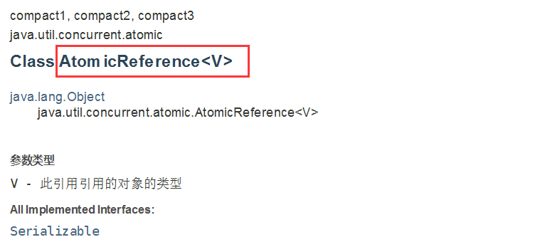

==注意：==

**Integer 使用了对象缓存机制，默认范围是 -128 ~ 127 ，推荐使用静态工厂方法 valueOf 获取对象实
例，而不是 new，因为 valueOf 使用缓存，而 new 一定会创建新的对象分配新的内存空间；  **

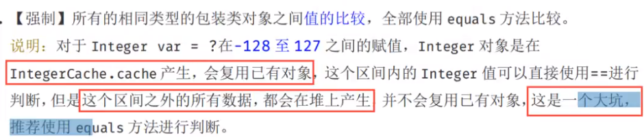

```java
package com.du.cas;

import java.util.concurrent.TimeUnit;
import java.util.concurrent.atomic.AtomicStampedReference;

public class ABATest {

    // AtomicStampedReference 注意，如果泛型是一个包装类，注意对象的引用问题
    // 正常在业务操作，这里面比较的都是一个个对象
    static AtomicStampedReference<Integer> atomic = new AtomicStampedReference(1, 1);

    public static void main(String[] args) {

        new Thread(() -> {
            // 获得版本号
            System.out.println(Thread.currentThread().getName() + "------1>" + atomic.getStamp());

            try {
                TimeUnit.SECONDS.sleep(2);
            } catch (InterruptedException e) {
                e.printStackTrace();
            }

            System.out.println(atomic.compareAndSet(1, 2, atomic.getStamp(), atomic.getStamp() + 1));
            System.out.println(Thread.currentThread().getName() + "------2>" + atomic.getStamp());

            atomic.compareAndSet(2, 1, atomic.getStamp(), atomic.getStamp() + 1);
            System.out.println(Thread.currentThread().getName() + "------3>" + atomic.getStamp());
            System.out.println();

        }, "A").start();

        // 乐观锁的原理相同
        new Thread(() -> {
            // 获得版本号
            int stamp = atomic.getStamp();
            System.out.println(Thread.currentThread().getName() + "------1>" + stamp);

            try {
                TimeUnit.SECONDS.sleep(2);
            } catch (InterruptedException e) {
                e.printStackTrace();
            }

            System.out.println(atomic.compareAndSet(1, 6, stamp, atomic.getStamp() + 1));
            System.out.println(Thread.currentThread().getName() + "------2>" + atomic.getStamp());

        }, "B").start();

    }
}
```

# 21、各种锁的理解

## 1、公平锁、非公平锁

公平锁： 非常公平， 不能够插队，必须先来后到！
非公平锁：非常不公平，可以插队 （默认都是非公平）  

```java
public ReentrantLock() {
	sync = new NonfairSync();
} 

public ReentrantLock(boolean fair) {
	sync = fair ? new FairSync() : new NonfairSync();
}
```

## 2、可重入锁

可重入锁（递归锁）

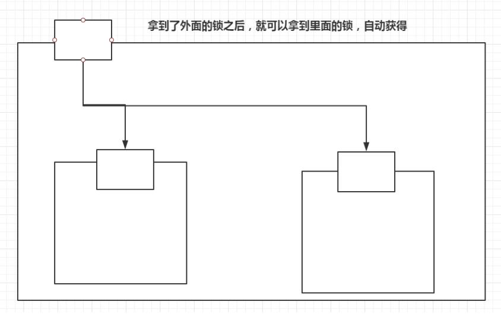

>   Synchronized

```java
package com.du.lock;

// Synchronized
public class Demo01 {
    public static void main(String[] args) {
        Phone phone = new Phone();
        new Thread(() -> phone.sms(), "A").start();
        new Thread(() -> phone.sms(), "B").start();
    }
}

class Phone {
    public synchronized void sms() {
        System.out.println(Thread.currentThread().getName() + "sms");
        call(); // 这里也有锁
    }

    public synchronized void call() {
        System.out.println(Thread.currentThread().getName() + "call");
    }
}
```

>   Lock 版 

```java
package com.du.lock;

import java.util.concurrent.locks.Lock;
import java.util.concurrent.locks.ReentrantLock;

public class Demo02 {
    public static void main(String[] args) {
        Phone2 phone = new Phone2();
        new Thread(() -> phone.sms(), "A").start();
        new Thread(() -> phone.sms(), "B").start();
    }
}

class Phone2 {
    Lock lock = new ReentrantLock();

    public void sms() {
        // 细节问题：lock.lock(); lock.unlock(); // lock 锁必须配对，否则就会死在里面
        lock.lock();
        lock.lock();
        try {
            System.out.println(Thread.currentThread().getName() + "sms");
            // 这里也有锁
            call();
        } catch (Exception e) {
            e.printStackTrace();
        } finally {
            lock.unlock();
            lock.unlock();
        }
    }

    public void call() {
        lock.lock();
        try {
            System.out.println(Thread.currentThread().getName() + "call");
        } catch (Exception e) {
            e.printStackTrace();
        } finally {
            lock.unlock();
        }
    }
}
```

### 3、自旋锁

spin lock

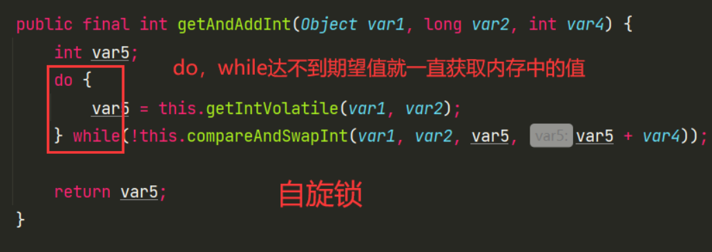

>   测试

```java
package com.du.lock;

import java.util.concurrent.TimeUnit;

public class TestSpinLock {
    public static void main(String[] args) throws InterruptedException {
        // ReentrantLock reentrantLock = new ReentrantLock();
        // reentrantLock.lock();
        // reentrantLock.unlock();
        // 底层使用的自旋锁CAS
        SpinLock lock = new SpinLock();
        new Thread(() -> {
            lock.myLock();
            try {
                TimeUnit.SECONDS.sleep(5);
            } catch (Exception e) {
                e.printStackTrace();
            } finally {
                lock.myUnLock();
            }
        }, "T1").start();

        TimeUnit.SECONDS.sleep(1);

        new Thread(() -> {
            lock.myLock();
            try {
                TimeUnit.SECONDS.sleep(1);
            } catch (Exception e) {
                e.printStackTrace();
            } finally {
                lock.myUnLock();
            }
        }, "T2").start();
    }
}
```

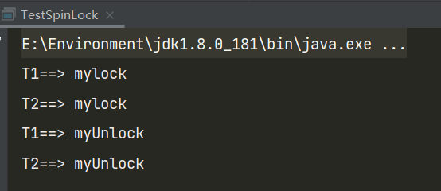

## 4、死锁

>   死锁

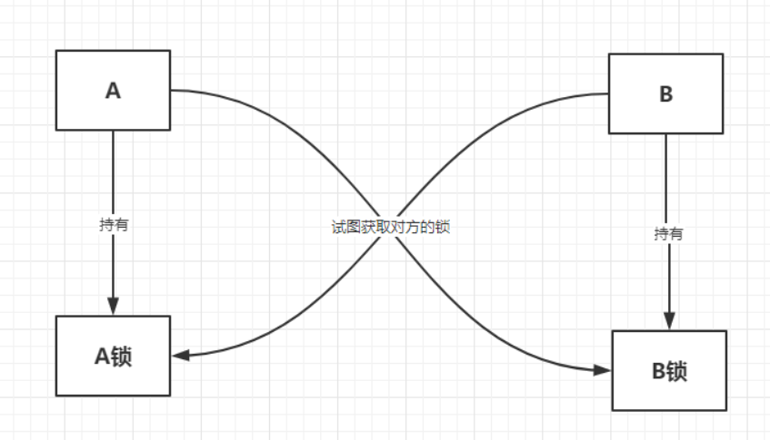

死锁测试，怎么排除死锁

```java
package com.du.lock;

import java.util.concurrent.TimeUnit;

public class DeadLock {
    public static void main(String[] args) {
        String lockA = "lockA";
        String lockB = "lockB";
        new Thread(new MyThread(lockA, lockB), "T1").start();
        new Thread(new MyThread(lockB, lockA), "T2").start();
    }
}

class MyThread implements Runnable {
    private String lockA;
    private String lockB;

    public MyThread(String lockA, String lockB) {
        this.lockA = lockA;
        this.lockB = lockB;
    }

    @Override
    public void run() {
        synchronized (lockA) {

            System.out.println(Thread.currentThread().getName() +
                    "lock:" + lockA + "=>get" + lockB);
            try {
                TimeUnit.SECONDS.sleep(2);
            } catch (InterruptedException e) {
                e.printStackTrace();
            }
            synchronized (lockB) {
                System.out.println(Thread.currentThread().getName() +
                        "lock:" + lockB + "=>get" + lockA);
            }
        }
    }
}
```

>   解决问题

1.  使用`jps -l`定位进程号

    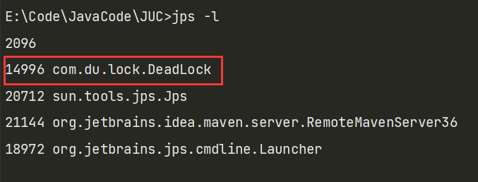

2.  使用`jstack 进程号` 找到死锁问题

    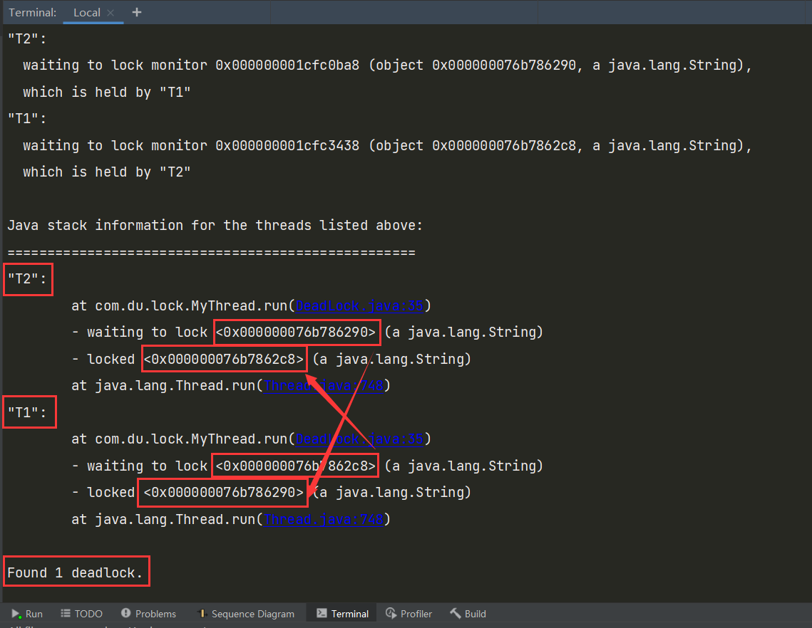

面试，工作中！ 排查问题：

1.  日志
2.  堆栈
